# Introduction 

## 1. Why Bug Bounty is Growing 

   

Bug bounty has been buzzing around the tech world for a few years and many companies are now starting to pay 10 times more than what they used to. Bug bounty programs help organizations to fix bugs in their applications, which invites many hackers to join their programs and hunt for vulnerabilities in their applications. Bug bounty isn't slowing down anytime soon, as companies are starting to invest a lot in their security. If you take a quick look at any active program, you can see that companies are offering very good pay, starting from $100 - $5000, which depends upon the criticality of the bug that is reported. 

In 2025, many startups and even governments are starting their own bug bounty programs, rather than relying on their security teams. This is actually helping them spot bug that their own team missed out on during the testing stage. 

The best part of these programs is that you don't need a degree to get started. If you are willing to learn and understand how things are actually working behind the web, then you are good to go; all you need is a laptop and an internet connection. In this article, we are going to review the top bug bounty courses you might want to enroll in 2025.

## 2. What is Bug Bounty

### How programs work 

A bug bounty program is when a security researcher spots a company that is inviting hackers to test their products for any potential vulnerabilities. Before starting your hunt on any website or app, we need to understand that every company has its own program policies, which are: 

Scope, 
Rules of engagement, 
Reward structure. 

Scope is the domain or sub-domains listed by the company to test for vulnerabilities. Rules of engagement are something that could be defined as what kind of testing is allowed and what's off-limits, and lastly, the reward structure tells you how much they pay for a valid bug. 

Once you understand the policy, the real hunting begins. You can find your targets and active programs on platforms like [HackerOne](https://www.hackerone.com/), [Bugcrowd](https://www.bugcrowd.com/), [Intigriti](https://www.intigriti.com/), [YesWeHack](https://www.yeswehack.com/) 

If you find a bug on any of these platforms, you are supposed to write a detailed report and generate a PoC(Proof of Concept) explaining the vulnerability and a methodology to reproduce it. Companies will then review your report and reward you based on it's severity. If it's a duplicate or doesn't meet their criteria, it might get rejected, and that's okay; we've all been there, and it's all part of the learning process.

### What hackers get paid for

Now that we've seen how programs actually work and how high the payouts are, let's see what they are actually paying us for.

All the bugs that you report fall into a category called [OWASP TOP 10](https://owasp.org/www-project-top-ten/), and the severity of these bugs is also scaled based on this list. This list consists of almost every possible bug starting from Broken access control to SSRF(Server side request forgery), If you've found a low-impact bug you can expect around $50-$100, but if you find something more critical like full account takeover or access to sensitive data then you could be looking at $1,000 to $5,000 or sometimes even more.

### Real-World Example: Coinbase's Biggest Bug Bounty Ever

I've come across a very interesting vulnerability on a crypto platform called Coinbase, and I always wondered what could have happened if such bugs hadn't been reported.

  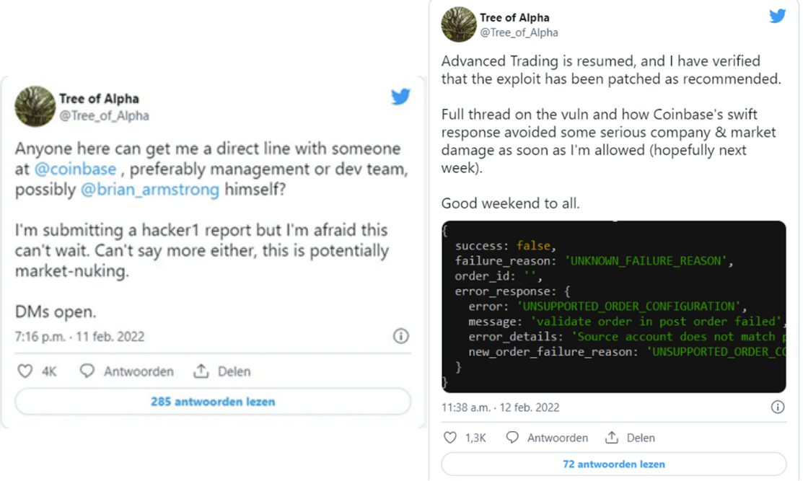

So basically, you were allowed to trade crypto currency that you didn't even own. Imagine you're about to place a trade, but instead of spending SHIB, Shiba Inu from your wallet, you are selling BTC which you don't own. Now that's unlimited money!!

This bug was reported by a security researcher [Tree of Alpha](https://x.com/Tree_of_Alpha) in February 2025, earning a $250,000 bounty, which was the largest payout Coinbase has ever made. 

This was all because of a missing validation check in their API; the platform couldn’t tell whether the crypto and the user's account matched. So someone could easily trick it into thinking they had Bitcoin, which they didn’t, and still place real trades.

If you're curious about how such API bugs work, you should check out the courses listed below that focus mainly on API security.

### 3. Getting Started: Skills, Tools, & Platforms

#### Basic skills needed :

Before getting started, we need to get our basics right. There are some prerequisites that you need to have before you take up any bug bounty course. You can start with: 

- Understanding how HTTP requests work. 
- Basics of networking, which includes TCP/IP and the OSI model. 
- Working of the DNS(Domain Name System) 
- Linux command line 

Now, are these skills enough? No, one of the most common debates in bug bounty is whether you need to know programming. And the answer is yes, having a basic understanding of any one programming language is always an advantage when looking for vulnerabilities. Example: Many applications are built on HTML/CSS and, of course, JavaScript, so before even learning to break things, you are supposed to learn how they are built. 

Now, what about scripting? You’ll run into this word a lot. Is it really necessary? Not when you're just getting started. Scripting can be used when you want to automate your daily tasks or build your your own tools, but for beginners, most of what you need is already out there. Finally, learning these languages would be your best choice. 

Programming Languages: HTML/CSS, JavaScript Scripting 
Languages: Bash, Python, and GoLang

**Tools to learn first**

There are plenty of tools available, but if you want to learn every tool before you start attacking real targets can take you years. Instead, you can start by quickly learning some of the most common tools used in application security or bug hunting.

A good way to start is by getting familiar with Kali Linux. **Kali Linux** is the OS for hackers, and mastering its command line can save you a lot of time. It comes preloaded with most of the tools that you'll use in your daily tasks. Some of them are:

 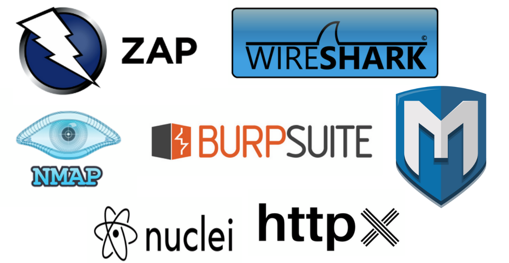

- Burpsuite 
- OWASP ZAP 
- Nmap 
- Wireshark 
- Metasploit 
- Nuclei 
- Httpx

#### Practice platforms to use 

There are a few platforms where you can practice all the attacks in OWASP TOP 10 with different case scenarios. These platforms will help you simulate attacks that happen in the real world. Here are a few platforms which will help you, 

- **HackTheBox :** HTB is a platform that helps you simulate attacks and find vulnerabilities. It is a CTF style training platform where you can practice attacks related to different domains including web. 

- **TryHackMe :** Similar to HTB, THM is another platform where you find vulnerable rooms recreating real world attacks scenarios. These rooms include web as one of their categories. 

- **Damn Vulnerable Web Application :** DVWA is a vulnerable application that's built on PHP/MariaDb. You can't find this application online like HTB and THM. You are supposed to build your own lab using the kali terminal, if you are a beginner you might find it difficult to set it up but once you do, it's really fun and exciting when you start attacking. It contains most of the OWASP TOP 10 vulnerabilities.

- **bWAPP :** Buggy Web Application is another vulnerable web application similar to DVWA. This one is unique and way more interactive compared to DVWA. You can set it up on a windows machine and also on your kali linux.

# Best Bug Bounty Courses For Free

#### 1. Portswigger Web Security Academy

PortSwigger Academy is designed by the same people who developed Burpsuite, they offer courses for beginners who are new to application security and are looking to learn things in a practical way and controlled environments. In my opinion this course is always on the top of the list when searching for bug bounty courses, as it contains detailed hands-on labs for every single vulnerability that you might come across when you start hunting.

 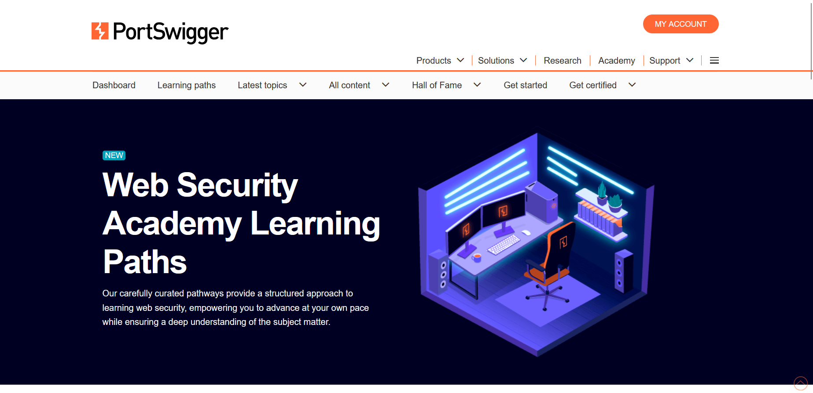

**Where to find them** 

You can find this course on PortSwigger's official website by navigating to the academy tab. 

Link : [PortSwigger Web Security Academy ](https://portswigger.net/web-security)

**What to expect** 

This course categorizes the attacks into two different categories, client side and server side mastering every lab you come across can help you cover most the basics in security. To begin with you can start directly with their featured modules, SQL Injection, Cross-Site Scripting(XSS), CSRF, and XXE.

With over 190 interactive labs, finishing at least 7 labs per day will help you complete the entire course in a month. After completing the courses you are no longer a beginner and ready to attack on the real target but don't expect to find all the vulnerabilities you practice in the lab to find it on real targets, most do assume that, especially since some lab examples are basic, while real-world targets are much more complicated.

#### 2. Hacker101 by HackerOne

HackerOne, known as the top bug bounty platform, also offers a course on application security called Hacker101. This course is easy to follow and contains hands-on labs that teach you how real-world bugs work.

 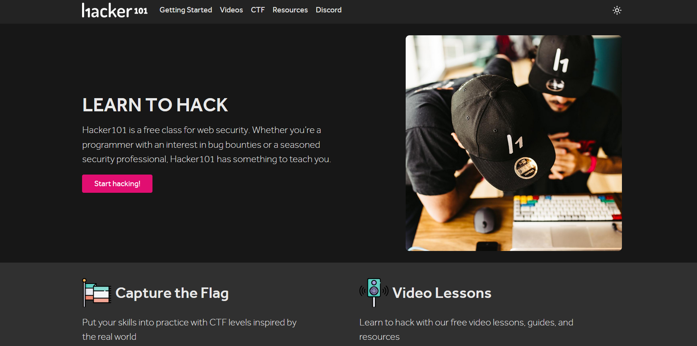

**Where to find them**

Head straight to the official Hacker101 website. 
Link : [Hacker101 by HackerOne](https://www.hacker101.com/) 

**What to expect**

This course consists of video lectures and the labs are designed in CTF-style (Capture The Flag), simulating real-world attack scenarios. Solving these CTF challenges gives you
points, making you feel more like playing a game than completing a course. Once you manage to get enough CTF points, you can unlock the private programs on HackerOne,
which most of the regular hunters cannot access. You can complete this course if you can finish at least 1-2 labs per day.

#### 3. API Security – OWASP API Top 10 and Beyond

The two courses we covered so far focus mostly on traditional web application security like forms, sessions, cookies, and the regular OWASP TOP 10 bugs. But this course is different; OWASP API unlike the other two, it introduces you to a new OWASP category called the [OWASP API Top 10](https://owasp.org/API-Security/editions/2023/en/0x11-t10/) vulnerabilities.

 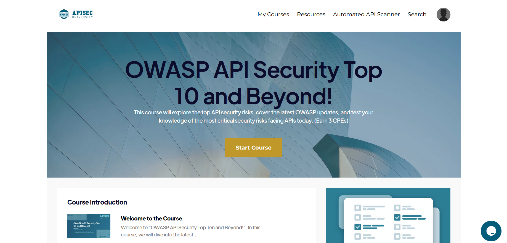

**Where to find it** 

You can check out this course directly on the official APIsec University website. 

Link : [OWASP API Security Top 10 and Beyond!](https://www.apisecuniversity.com/courses/owasp-api-security-top-10-and-beyond)

**What to expect** 

This course consists of a video series taught by Corey Ball, and it's completely focused on API security testing. I wouldn't suggest this course for beginners right away because APIs are kind of advanced topics; though you understand how APIs work, testing them is not as easy as it looks. One of the best examples of API security issues is the Coinbase vulnerability that we just looked at. 

In this course, Corey explains how APIs are designed and where they typically fail. He practically demonstrates how to exploit the most common vulnerabilities in APIs like Broken Object Level Authorization, Broken Authentication, and mass assignment using different tools. 

This is one of the best courses available for free, which is focused only on API security, and the ideal time to complete this course would be 10 hours. 

#### 4. API Penetration Testing (by APIsec University) 

This one is again from the APIsec university. This course picks up where the OWASP API TOP 10 and Beyond leaves off. Again, this isn't for beginners. If you're already familiar with basic API security concepts and want to level up, this is the perfect next step.

 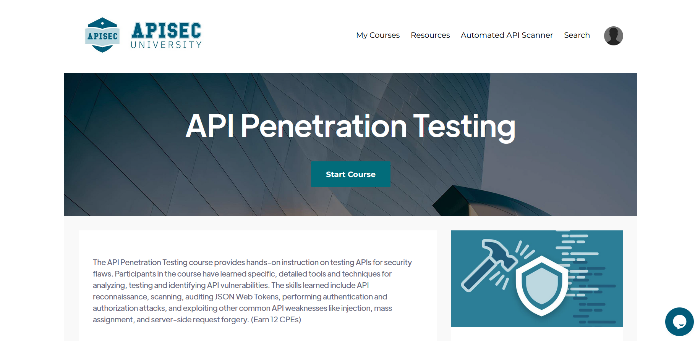

**Where to find it** 

You can find it right on APIsec University’s site. Like all their courses, it’s free. 
Link : [API Penetration Testing ](https://www.apisecuniversity.com/courses/api-penetration-testing)

**What to expect** 

This course is designed for people who want to learn more than just the basics. In this course, you will be asked to set up a lab with live instructions. After you set up your lab, there's a walkthrough on how to discover and map out APIs before even starting the attack, basically a recon. 

This course also teaches you to craft your payloads, which I feel is the best way to learn breaking things. After completing this course, you can manually test APIs without relying on tools. 
The duration of this course is approximately 6–8 hours. I suggest you take your time and try out things, rather than rushing to complete the entire series.

#### 5. Android Application Security - Free Course

This course is very underrated and was designed by MobileHackingLab. There aren't many good courses available in this domain, so if you're not just sticking to web security and want to explore something outside the web, then this is one for you.

 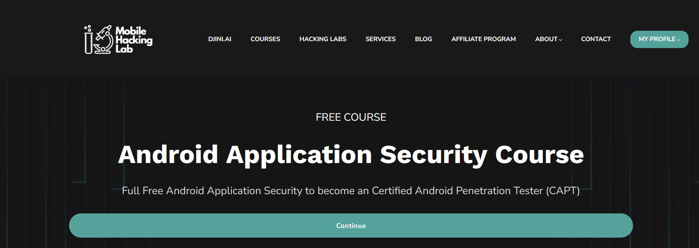

**Where to find it**

Navigate to the courses tab on the official page of MobileHackingLab's website, and you'll find it there. 

Link : [MobileHackingLab](https://www.mobilehackinglab.com/course/free-android-application-security-course)

**What to expect** 

If you're just getting started in Android security, this is a great place to begin. It is beginner friendly, but they do expect you to have some basic knowledge of Android application development. 
In this course, you'll be working with a vulnerable Android app and, unlike web security, Android application security introduces you to a new set of tools, such as MobSF, Frida, Apktool, and others. When talking about learning Android application security, we all assume that we need a rooted device or a physical Android phone, but for this course, you don't need any of that. It’s compatible with Android emulators and test environments. This course also prepares you for one of their certification exam called **CAPT (Certified Android Penetration Tester)**, which is a paid certificate.

# 5. Paid Courses 

#### 6. [HTB Certified Bug Bounty Hunter (CBBH) ](https://academy.hackthebox.com/preview/certifications/htb-certified-bug-bounty-hunter)

CBBH is an industry standard certificate offered by HackTheBox, which is a CTF platform. This course is for beginners and for someone who is looking to invest in some quality courses, considering they have some basic knowledge of application security. 

 

**When to invest** 

First, let's understand the pricing structure of this course. The certification exam costs $210. But, wait, the course content is much cheaper, and you can unlock it using a subscription plan. There are two subscription plans available to unlock this course:

Student Subscription - $7/month 
Platinum Subscription - $84 for 2 months, gives you 2000 cubes, which is enough to unlock the whole path. 

The certificate cost is quite expensive for beginners, but unlocking the course content can be worth it. If you are a beginner, now is the right time to unlock the course and start learning. You can purchase the exam voucher later, once you're confident with the material. 

**What makes it worth it** 

The course content is good, starting from the basics of web applications and then moving to advanced topics of application security like XSS, SQLi, SSRF, covering most of the attacks from the OWASP Top 10. You’ll need approximately 3-5 weeks to complete the course and prepare for the exam. As this is an industry standard certificate, you can always use this as a credential when applying for internships or jobs.

#### 7. [Burp Suite Certified Practitioner](https://portswigger.net/web-security/certification)

Burp Suite Certified Practitioner (BSCP) can be considered as the OSCP for web. This certificate offered by Portswigger consists of 4 hours of practical exam, in which consists of two vulnerable systems with 12 challenges in total, which you are supposed to hack and exploit. You must solve at least 9 out of 12 challenges to pass the exam.

 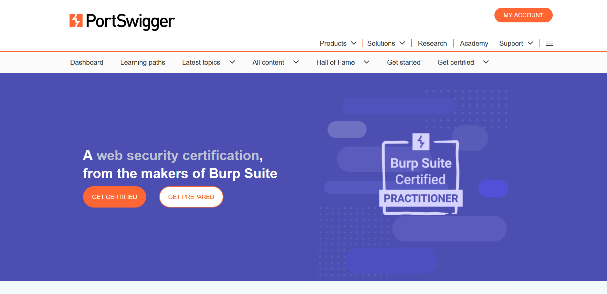

**When to invest** 

Looking at the exam structure, it's obvious that this isn't an entry-level cert. The right time to purchase this certificate is after you complete most of the Web Security Academy labs, especially the Practitioner and Expert level ones. 

The BSCP exam costs around $125 for a single attempt. But to attempt the exam, you must have a licensed version of Burp Suite Pro, which costs $449/year. Since it is pricey, I suggest you purchase the exam only once you're confident in your skills. 

**What makes it worth it** 

Passing the BSCP exam is worth it because this certification prepares you to hunt the most secure target in the real world. This can also be used as a qualification if you are applying for any jobs related to pentesting or application security, which increases your chances of getting hired. BSCP certificate is valid for five years from the date of issue.

#### [8. eLearnSecurity Web Application Penetration Tester (eWPT)](https://ine.com/security/certifications/ewpt-certification)

This certificate is ideal for people who are looking for something more structured than CBBH. This course has everything you need in application pentesting, starting from recon, enumeration, to exploitation.

 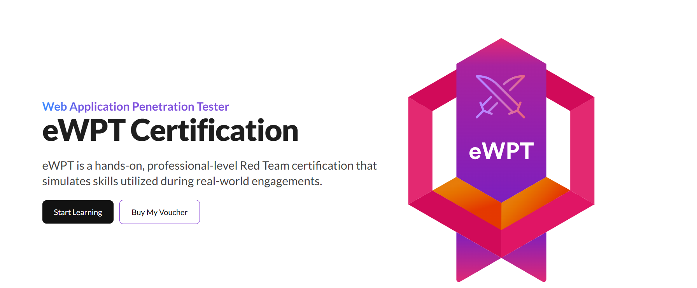

**When to invest**

The pricing for this course is quite expensive and confusing, eWPT Exam Voucher costs $599, which includes 3 months of INE Premium access. After those 3 months, you'll be auto-enrolled in a 9-month extension for $350, unless you choose to cancel. 

If you're planning to take this certificate, I would suggest you plan to study the course content accordingly and attempt the exam within the first 3 months to avoid extensions. 

**What makes it worth it** 

The course content is very structured based on practical black-box penetration testing, and the quality of labs is top-notch. Some older reviews say that the content is outdated and exams are unstable. But with the recent updates, people who passed the exam say that this certification still holds value, especially for showing strong skills in advanced web app pentesting. It's also a great way to build confidence before going after bug bounty targets or preparing for bigger certificates like OSCP.

#### [9. Intro to Bug Bounty Hunting and Web Application Hacking](https://www.udemy.com/course/intro-to-bug-bounty-by-nahamsec/?srsltid=AfmBOoo6EzFae9J_CzHk4sNPUJeuLFjj1LsbWfuLqJ56Sy5Yecypk6mj) 

There are a lot of bug bounty courses for beginners out there, but this one is one of my favorites because it's designed by Nahamsec. Nahamsec has been in the bug bounty picture for years, not just as an elite hacker, but as a community builder, streamer, and speaker. He’s someone many beginners look up to and aspire to become like.

 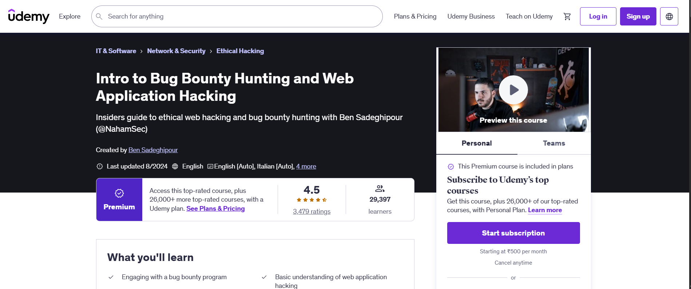

**When to invest** 

I would suggest you buy this course during a Udemy sale, as you can get it for as low as $15. The actual price of this course is around $80. Once you buy this course, it's all yours for life. 

**What makes it worth it** 

This course offers 11.5 hours of video content broken down into different topics, starting from he basics to advanced. Even if you haven't covered the basics completely, you can still take this course, as it is very beginner-friendly. This course also introduces different methodologies to approach your target, and I must say, NahamSec's bug bounty methodologies never disappoint anyone. They are raw, crisp, and always work. Although the course is 11.5 hours, I would suggest that you take at least 2 weeks to absorb the content properly.

#### [10. TCM Practical Bug Bounty](https://academy.tcm-sec.com/p/practical-bug-bounty) 

TCM security has partnered with Integrity to build this course. This course is designed to give you an actual workflow for web hacking, demonstrating exactly how you are supposed to deal with your targets in the real world.

 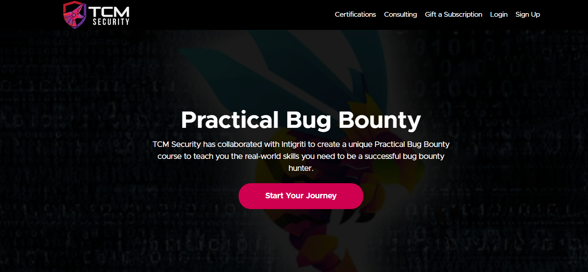

**When to invest** 

This is another budget-friendly option, designed for beginners. It costs around $29/month, which I feel is quite reasonable, and it gives you access to their complete course content. 

**What makes it worth it** 

This course clearly explains how web apps are built, covering the most common web architectures, including both the client-side and the server-side of web applications. You'll also come across some of the most common bugs like IDOR, Open Redirects, XSS, Broken Access Control, etc.

After completing this course, you'll be able to pick up a program, find bugs, and generate a valid report. This course has around 7 hours of video content; you can expect to complete it in a week or two, working at your own pace.

## 6. Choosing the Right Course 

With so many courses out there, choosing the one that fits you might be difficult, so let's narrow it down based on your skill level, preferred format, and budget.

#### Based on skill level 

Because not everyone has the same level of skills, let's sort the courses based on your experience level. 

**Beginners:** Suppose you have no idea where to start, but you've come here with the thought of learning bug bounty. In that case, I suggest you start with the Portswigger Web Security Academy, followed by Hacker 101 and the TCM Practical Bug Bounty course. These are self-paced and cover most of the basics, though you may not be familiar with the prerequisites already. 

**Intermediate:** Considering you have a basic understanding of how the web works, you can start with courses like CBBH, OWASP API Top 10 and Beyond, or even Bug Bounty by Nahamsec. These are great for intermediaries who don't want to start everything from scratch. 

**Advanced:** People who are already in the job and understand how things work can go with Burp Suite Certified Practitioner, API Penetration Testing, or eWPT.

#### Based on Format 

I see people are very particular about the way they want to learn things, so yeah, categorizing these courses by their format might actually help you pick the right one. 

**Interactive labs & challenges:** Courses like PortSwigger Academy, Hacker101, and HackTheBox CBBH are very practical. They're great if you prefer learning things by trying out stuff practically rather than reading through PDFs. 

**Video-focused learning:** Now, if you’re someone who learns by watching videos, courses like NahamSec’s Practical Bug Bounty, APISec University, and TCM Security’s Practical Bug Bounty training offer video content with clear and practical breakdowns. 

**Self-hosted or emulator-based:** These courses are best for people who want to get their hands dirty by setting up their lab. I suggest going for API Penetration Testing, Android Application Security, or eWPT.

#### Based on the Budget 

Since we've already categorized the top courses into free and paid, let's now sort the paid ones based on budget.

| **Course**                              | **Cost**                         | **Suggestions**                                                                  |
| --------------------------------------- | -------------------------------- | -------------------------------------------------------------------------------- |
| TCM Practical Bug Bounty                | $29/month                        | Start here if you're new to bug bounty; this is great for fundamentals.          |
| Intro to Bug Bounty (Nahamsec)          | $15 (on sale)                    | Grab it during a Udemy sale.                                                     |
| HTB Certified Bug Bounty Hunter (CBBH)  | $210                             | Complete the course before attempting the exam; use the student plan if possible |
| BSCP (Burpsuite Certified Practitioner) | $125 + Burp Pro ($449/year)      | Finish PortSwigger Academy labs first and only attempt when you're confident.    |
| eWPT (eLearnSecurity Web PenTesting)    | $599 + $350 extension (optional) | Plan to finish in the first 3 months to avoid extra charges on extension.        |

## 7. Tips for Beginners

#### Practice alongside theory

As we discussed earlier in the "practice platforms to use" part of this article, I'd suggest you set up your lab environment and practice them along with the theory and videos. Getting hands-on will improve your understanding of how the attacks work in the real world. 

For example, take XSS; just reading about the types of XSS won't teach you how to test for these attacks on your target. Instead, try attacking the labs that you've set up, spotting the requests, and injecting payloads will give you a much better understanding.

#### Join communities 

Joining security communities is one of the best ways to meet new people. You might find a mentor or like-minded people working on the same course, cert, or project as you are. Some discord channels I’d suggest joining: 

- [HackTheBox](https://discord.com/invite/hackthebox): - A community with over 318,042 members gives you access to hacking challenges, labs, and the HTB Academy. 

- [TryHackMe](https://discord.com/invite/tryhackme): - It is focused on beginner-friendly cybersecurity learning you can chat with others about walkthroughs, challenges, and CTFs 

- [DavidBombal](https://discord.com/invite/davidbombal): - Everything about networks and cybersecurity can be discussed here, this server is led by David Bombal a famous youtuber. 

- [Nahamsec](https://discord.com/invite/nahamsec-598608711186907146): - A community over 35,711 members actively discussing about bug bounty, recon, and offensive security.

#### Take notes and revisit

 Write down everything you see, hear, and learn, like commands, tools, bugs, or even techniques and procedures, which will help you recap the topics. Notion and Obsidian are digital notebooks which is a great choice for taking notes. Revisit these notes regularly to track your progress.

#### Automation is a key to success

In 2025, everything is automated. Almost every task in cybersecurity can be automated if you've got great scripting skills. Be it scanning targets or exploiting vulnerabilities, automation helps you save time. Mastering scripting tools like Bash and Python or automating workflows with platforms like Burp Suite (using extensions or macros), Nmap (using NSE scripts), can reduce your manual testing load. 

Let's take an example: You can write a one-liner bash command to automatically fetch URLs using waybackurls, and scan them with gau, and then pipe the output into tools like gf for filtering potential parameters, which can save a lot of time during recon.

**One-liner Command:** 

echo "target.com" | waybackurls | tee wayback.txt && gau target.com | tee gau.txt && cat wayback.txt gau.txt | sort -u | gf xss 

It’s okay if you don’t understand the command right now; many beginners feel the same. It will all make sense once you start learning it step by step.

#### Real-World Success Stories

**I. Santiago Lopez – $9,000 Bug on Twitter via HackerOne**

 

Santiago Lopez, also known as [@try_to_hack](https://hackerone.com/try_to_hack?type=user), was one of the first hackers on HackerOne to earn more than a million dollars. At just 19 years old, he was able to hack into Twitter and change users' email settings without users' knowledge. His scripting skills helped him craft malicious requests, which he injected and later used to facilitate account takeovers. This vulnerability is called CSRF or Cross-Site Request Forgery, which basically exploits users' authenticated sessions. He made around $9,000 for this single bug. This is how much someone can make from bug bounties. Santiago rewarded himself with cars, computers, and a beach house on a private estate. You could be the next one in a few years if you start now. He said in an interview that he generally spends around 6-7 hours hacking, usually in the evenings, which has helped him reach his current level.

**II. Frans Rosen**

 

[Frans Rosen](https://hackerone.com/fransrosen?type=user) is a security researcher with over $1.5 million in total bug bounty rewards. With more than 876 vulnerabilities reported on HackerOne, he is considered one of the top researchers. Rosen is an experienced hunter. He once reported a CORS misconfiguration on a SaaS platform that let an attacker read sensitive data, which includes internal API responses across origins, which is a very critical issue and could lead to account takeovers. Most of his findings are kept confidential for some reason, but we do understand that he is making a lot just by hunting bugs on applications.

## 8. What’s Next

#### Sign up on platforms

Now that we have looked at almost everything in detail, starting from what a bug is, how it is reported, and how much you get paid. Let's sign up on platforms like HackerOne, Bugcrowd, Integrity, and start hunting. Delaying anything from here on will only put you one step away from others. There are many targets out there on those platforms waiting for you, so let's not waste time and get to work.

#### Start with Small Scopes 

For beginners, choosing a target can be very confusing and might end up with the wrong one. So let's start with a small scope rather than focusing on the top programs. After picking up the target with a small scope, spend some time understanding their policies before jumping straight into attacking. It’s better to report one valid low-severity bug than chase a critical one and burn out. In a later post in this series, we will also cover how to pick your first target.

#### Build Your Portfolio

A good portfolio speaks louder than your resume. These portfolios that you are going to create on HackerOne and Bugcrowd will help you stand out from the crowd someday. HackerOne portfolios prove that you actually have that industry exposure that all the HRs are looking for. You can also start writing security blogs and publish them online on Medium, which will help you build your online presence.

## 9. Final Thoughts

#### Should You Learn Bug Bounty? 

Absolutely, you should!!! Now that we are in 2025, bug bounty is getting way more popular. Many people are just getting started, including professional developers switching their careers to become security researchers. But it's never too late; this is the right time to start learning and step into the field.

#### Keep Learning 

The technologies you see today might not even exist tomorrow. As a hacker, you'll often come across new technologies on your targets every day. That's why continuous learning helps you stay updated. Here's a tip I follow to stay updated: turn on notifications for the Medium app, and every time someone posts a blog, you get notified. Sure, some titles are kind of clickbait, but there's still something valuable to learn. I read at least 10 blogs a day, and honestly, it’s one of the best habits that helps me hunt smarter.

#### Stay Consistent 

Consistency is the key to achieving any task, and it's no different in bug bounty, though you don't find a valid bug on multiple attempts, learning new methodologies and attack techniques consistently can actually help you find your first bug. 

Bug bounty is more than just code and exploits; it’s a mindset, a thrill, and a journey of endless learning. Stay tuned, because in the next blog of this series, we’ll guide you through picking your first target and mastering recon, step by step!
